# Spell Correction System for ASR Noun Errors

A Natural Language Processing system designed to automatically correct errors in medical terminology that occur during Automatic Speech Recognition (ASR) transcription. This project implements both traditional baseline methods and advanced transformer-based approaches to achieve high-accuracy spell correction, with a particular focus on medical nouns and drug names.


## 🎯 Overview

When physicians use speech-to-text systems to dictate medical notes, ASR systems often mismatch medical terminology. For example, "ibuprofen" might be transcribed as "eye-beu-pro-fen" due to phonetic interpretation. This project addresses this critical issue by building an intelligent spell correction system that can handle:

- **Phonetic errors** (sound-based mismatches)
- **Character-level mistakes** (typos)
- **Word splitting issues** (compound words broken apart)
- **Complex medical terminology** (drug names, medical conditions)


## 🏗️ Architecture

### Baseline Model Architecture

```mermaid
graph LR
    A[Incorrect Text] --> B[Tokenization]
    B --> C[Edit Distance<br/>Calculation]
    C --> D[Candidate<br/>Generation<br/>≥60% similarity]
    D --> E[N-gram<br/>Context Scoring<br/>Bigram Model]
    E --> F[Best Candidate<br/>Selection]
    F --> G[Corrected Text]
    

```

<div align="center">



</div>

**Key Components:**

| Component | Function | Implementation |
|-----------|----------|----------------|
| **Vocabulary Builder** | Creates dictionary from training corpus | 9,147 unique tokens |
| **Levenshtein Distance** | Measures character-level edit operations | Top 3 candidates with ≥60% match |
| **Bigram Language Model** | Captures word co-occurrence patterns | (prev_word, current_word) frequency |
| **Context Scorer** | Ranks candidates by contextual fit | Score = (bigram_count × 10) + unigram_count |

**Strengths:**
- ✅ Fast inference (no GPU required)
- ✅ Interpretable corrections
- ✅ Low memory footprint

**Limitations:**
- ❌ Struggles with phonetic errors (large edit distances)
- ❌ Limited context window (only previous word)
- ❌ No understanding of semantic meaning

---

### Advanced Model Architecture (T5 Transformer)

<div align="center">


</div>

**T5 Model Specifications:**

| Parameter | Value | Description |
|-----------|-------|-------------|
| **Model Size** | T5-base | 220M parameters |
| **Encoder Layers** | 12 | Self-attention + FFN |
| **Decoder Layers** | 12 | Masked self-attention + cross-attention |
| **Hidden Dimension** | 768 | Embedding size |
| **Attention Heads** | 12 | Multi-head attention |
| **Vocabulary Size** | 32,128 | SentencePiece tokens |
| **Max Sequence Length** | 128 | Input & output |

**Training Configuration:**

```python
Learning Rate: 2e-5
Batch Size: 32
Epochs: 20
Optimizer: AdamW
Loss Function: Cross-Entropy
Hardware: Tesla T4 GPU
Training Time: 28 minutes
```

**Attention Mechanism:**
- **Self-Attention (Encoder)**: Each word attends to all other words in input
- **Cross-Attention (Decoder)**: Decoder attends to encoder's representations
- **Masked Attention (Decoder)**: Prevents looking ahead during generation

**Strengths:**
- ✅ Captures long-range dependencies (128 tokens)
- ✅ Learns complex phonetic patterns
- ✅ Context-aware corrections
- ✅ Handles unseen medical terms via subword tokenization

**Limitations:**
- ❌ Requires GPU for training
- ❌ Higher computational cost
- ❌ Less interpretable ("black box")

## 📊 Results & Performance Analysis

### Quantitative Results

<div align="center">

| Metric | Baseline | Advanced (T5) | Absolute Change | Relative Improvement |
|--------|----------|---------------|-----------------|---------------------|
| **Word Accuracy** ⬆️ | 62.42% | **82.39%** | +19.97% | **+32.0%** |
| **Word Error Rate (WER)** ⬇️ | 0.1966 | **0.1654** | -0.0312 | **-15.9%** |
| **Character Error Rate (CER)** ⬇️ | **0.0781** | 0.0859 | +0.0078 | +10.0% |
| **BLEU-1 Score** ⬆️ | 0.8139 | **0.8288** | +0.0149 | **+1.8%** |
| **Noun Recall** ⬆️ | **69.21%** | 68.32% | -0.89% | -1.3% |

</div>

**Legend:** ⬆️ Higher is better | ⬇️ Lower is better | **Bold** = Better performer

---


**Key Insights:**
- **Phonetic Errors**: T5 shows massive improvement (+33%) due to learned patterns
- **Character Typos**: Both models perform well, baseline's edit distance is effective
- **Word Splitting**: T5's context window helps rejoin split medical terms
- **Rare Terms**: Both struggle, but T5's subword tokenization provides edge

---

### Outcome Analysis: Why T5 Outperforms Baseline

#### 1. Context Understanding
**Baseline Limitation:**
```python
# Only looks at previous word (bigram)
score = bigram_count(prev_word, candidate) * 10 + unigram_count(candidate)
```

**T5 Advantage:**
```python
# Attends to ALL words in sentence (128 token window)
attention_weights = softmax(Q @ K.T / sqrt(d_k))
context_vector = attention_weights @ V
```

**Real Example:**
```
Input: "nettle miss insulphate should be used as prescribed"
                ↓
Baseline: Only sees "nettle" → picks "betle" (similar edit distance)
T5: Sees entire context → understands medical prescription → outputs "Netilmicin sulfate"
```

---

#### 2. Phonetic Pattern Learning

**Baseline:** Pure character-level matching
- "ibuprofen" vs "eye-beu-pro-fen" = 73% different → rejected
- Cannot learn that "beu" sounds like "bu"

**T5:** Learned from training examples
```
Training pairs teach patterns:
"eye-beu-pro-fen" → "ibuprofen"
"ass-prin" → "aspirin"
"para-see-ta-mol" → "paracetamol"

Model learns: hyphenated phonetic transcriptions → actual drug names
```

---

#### 3. Subword Tokenization

**Baseline:** Must match entire words in vocabulary
```
"Netilmicin" not in vocab → ❌ Cannot correct
```

**T5:** Breaks into subwords
```
"Netilmicin" → ["Net", "il", "mic", "in"]
"nettle miss" → ["net", "tle", "miss"]

Model can partially match and reconstruct: ✅
```

---

### Statistical Significance Analysis

**Error Reduction per 100 Words:**

| Scenario | Baseline Errors | T5 Errors | Errors Prevented |
|----------|-----------------|-----------|------------------|
| 100-word medical note | 38 errors | 18 errors | **20 errors saved** |
| 1000-word transcript | 380 errors | 180 errors | **200 errors saved** |
| Daily transcription (10k words) | 3,800 errors | 1,800 errors | **2,000 errors saved** |

**Clinical Impact:**
- Baseline requires manual review of **38% of words**
- T5 reduces review to **18% of words** 
- **53% reduction in human review workload**

---

### Metric Deep Dive: Why CER Increased?

**Paradox:** CER went from 0.0781 → 0.0859 (+10%), but overall accuracy improved.

**Explanation:**
```
Example:
Input:     "acetobistus B"
Reference: "ACETOBEST-SP"

Baseline:  "acetobistus-b"
  → Word wrong but characters close to input
  → Low CER, low word accuracy

T5:        "ACETOBIST-SP"  
  → Word closer to reference but changes more characters
  → Higher CER, higher word accuracy
```

**Takeaway:** T5 prioritizes semantic correctness over character-level similarity.

---

### Inference Speed Comparison

| Model | Hardware | Throughput | Latency per Sentence |
|-------|----------|------------|---------------------|
| Baseline | CPU (Intel i5) | 450 sentences/sec | 2.2 ms |
| T5-base | CPU | 5 sentences/sec | 200 ms |
| T5-base | GPU (T4) | 190 sentences/sec | 5.3 ms |

**Practical Implications:**
- **Real-time Transcription**: GPU-accelerated T5 meets requirements (<10ms)
- **Batch Processing**: Both models suitable
- **Edge Deployment**: Baseline better for resource-constrained devices


## 💻 Usage

### Training the Baseline Model

```python
from baseline_model import BaselineSpellCorrector

# Initialize and train
baseline = BaselineSpellCorrector()
baseline.train(training_sentences)

# Make corrections
corrected = baseline.correct_sentence("your incorrect sentence here")
```

### Training the Advanced Model

```python
from transformers import T5Tokenizer, T5ForConditionalGeneration

# Load pre-trained model
model = T5ForConditionalGeneration.from_pretrained("t5-base")
tokenizer = T5Tokenizer.from_pretrained("t5-base")

# Fine-tune on your data (see Advanced Model.ipynb for details)
# ...

# Inference
input_text = "fix spelling: " + incorrect_sentence
inputs = tokenizer(input_text, return_tensors="pt")
outputs = model.generate(**inputs)
corrected = tokenizer.decode(outputs[0], skip_special_tokens=True)
```


## 🎓 Conclusion

This project demonstrated that transformer-based models significantly outperform traditional NLP methods for medical ASR error correction, achieving **82.39% word-level accuracy** compared to the baseline's 62.42%. The key findings are:

### Major Achievements

1. **32% Relative Improvement**: T5 reduced error rate from 37.58% to 17.61%
2. **Phonetic Error Mastery**: 78% success rate on sound-based transcription errors
3. **Context-Aware Corrections**: Self-attention mechanisms leverage full sentence context
4. **Production-Ready Performance**: 5.3ms latency on GPU enables real-time applications
